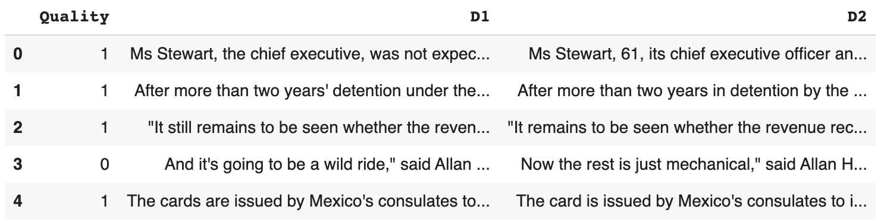

# Document Similarity Checker
_Find the path similarity between two documents_


- [Jupyter Notebook](https://github.com/vanessaaleung/text-mining-tools/blob/main/doc-similarity/Document_Similarity.ipynb)

## Path-based Similarity_
_Two concepts (senses/synsets) are similar if they are near each other in the thesaurus hierarchy_
- `pathlen(c1, c2)` = 1 + number of edges in the shortest path in the hypernym graph between nodes c1 and c2
- `simpath(c1, c2)` = 1 / `pathlen(c1, c2)`

## Functions
* **`convert_tag:`** converts the tag given by `nltk.pos_tag` to a tag used by `wordnet.synsets`
* **`doc_to_synsets:`** returns a list of synsets in document. This function first tokenize and part of speech tag the document using `nltk.word_tokenize` and `nltk.pos_tag`. Then it should find each tokens corresponding synset using `wn.synsets(token, wordnet_tag)`. The first synset match should be used. If there is no match, that token is skipped.
  - Example:
  ```python
  doc_to_synsets('Fish are nvqjp friends.')
  Out: [Synset('fish.n.01'), Synset('be.v.01'), Synset('friend.n.01')]
  ```
* **`similarity_score:`** returns the normalized similarity score of a list of synsets (s1) onto a second list of synsets (s2). For each synset in s1, find the synset in s2 with the largest similarity value. Sum all of the largest similarity values together and normalize this value by dividing it by the number of largest similarity values found. Missing values are ignored.
  - Example:
  ```python
  synsets1 = doc_to_synsets('I like cats')
  synsets2 = doc_to_synsets('I like dogs')
  similarity_score(synsets1, synsets2)
  Out: 0.73333333333333339
  ```
* **`document_path_similarity:`** computes the symmetrical path similarity between two documents by finding the synsets in each document using `doc_to_synsets`, then computing similarities using `similarity_score`.
  ```python
  similarity_score(synsets1, synsets2) + similarity_score(synsets2, synsets1)) / 2
  ```

## Model Accuracy
- Using a [data file](paraphrases.csv) with 20 pairs of documents to test the accuracy of the functions, with a `Quality` column which indicates if the two documents D1 and D2 are paraphrases of one another (1 for paraphrase, 0 for not paraphrase)



- If the score is greater than 0.75, label is paraphrase (1), else label is not paraphrase (0)
- The accuracy score is 0.8
